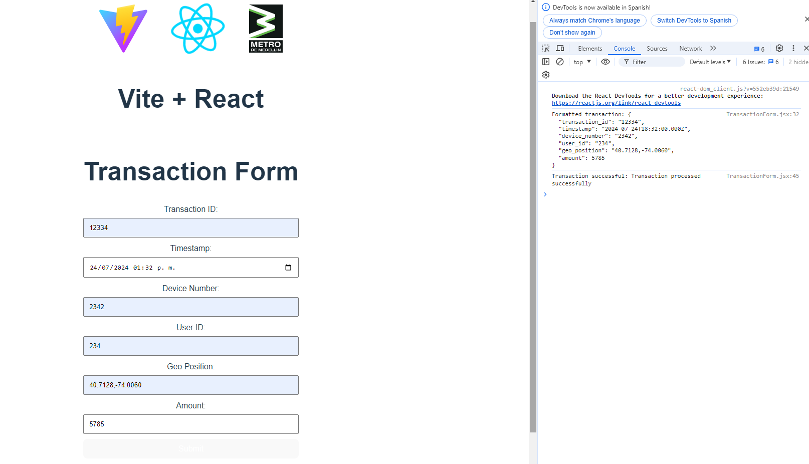

# React + Vite

This template provides a minimal setup to get React working in Vite with HMR and some ESLint rules.

Currently, two official plugins are available:

- [@vitejs/plugin-react](https://github.com/vitejs/vite-plugin-react/blob/main/packages/plugin-react/README.md) uses [Babel](https://babeljs.io/) for Fast Refresh
- [@vitejs/plugin-react-swc](https://github.com/vitejs/vite-plugin-react-swc) uses [SWC](https://swc.rs/) for Fast Refresh

### Clone the Repository
```sh
git clone https://github.com/canmios/microfrontend-react-metro
```

### Build the Project
```sh
cd microfrontend-react-metro
npm install
```

### Start the services:

```sh
npm run dev
```

### Docker:

```sh
docker-compose build
docker-compose up
```

### Run the Application
Application
-----------


# Vite

### Fast Development Server
Instant Server Start: Vite leverages native ES modules in the browser to serve files directly, which eliminates 
the need for a bundling step during development. This results in extremely fast server start times.

### Optimized Build Process
Pre-Bundling: During development, Vite pre-bundles dependencies using esbuild, a fast JavaScript bundler and minifier. 
This improves performance and reduces the overhead of handling dependencies.

### Modern Features
ES Module Support: Vite natively supports ES modules, allowing you to use modern JavaScript features and syntax without needing additional configuration.
Rich Plugin Ecosystem: Vite has a rich ecosystem of plugins that enhance its functionality, including plugins for various frameworks, utilities, and integrations.

### Enhanced Developer Experience
Configurable: Vite offers a flexible and easy-to-configure setup using a vite.config.js file
, allowing developers to customize their build and development environment according to their needs.
Built-in Support for Popular Frameworks: Vite comes with out-of-the-box support for popular frameworks like React, Vue, and Preact, reducing the need for additional configuration.

### Focus on Speed
On-Demand Compilation: Vite compiles and serves files on-demand, meaning only the files that are actually needed are processed. This reduces the build time and improves the overall development experience.
Efficient Code Splitting: Vite uses Rollup for code splitting and tree-shaking in production, which helps in generating smaller and more efficient bundles.